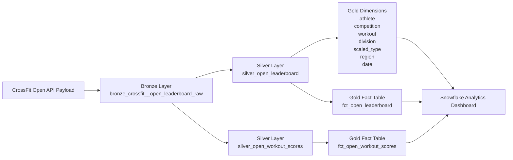

# CrossFit Open Analytics — dbt + Snowflake

## Overview

This project demonstrates a modern analytics engineering pipeline built using **Snowflake and dbt** to model CrossFit Open leaderboard data.

Raw CrossFit Open leaderboard API payloads are ingested into Snowflake, standardized using **dbt transformations**, and modeled into a **dimensional star schema** that powers analytical dashboards.

The pipeline follows a **Medallion Architecture (Bronze → Silver → Gold)** to transform nested API data into analytics-ready tables that support performance, competition, and participation analysis across CrossFit Open events.

---

# Project Objective

The objective of this project is to transform **raw CrossFit Open leaderboard API payloads** into a clean, documented analytical model capable of answering key performance questions such as:

- Who wins each division of the CrossFit Open?
- How consistent are top-performing athletes across workouts?
- Which workouts create the greatest separation between competitors?
- How competitive are different divisions in the CrossFit Open?

These questions are answered through a **dimensional analytics model built in dbt and visualized through a Snowflake dashboard**.

---
## Architecture Overview

The pipeline follows a **Medallion Architecture** where raw CrossFit leaderboard data flows through Bronze, Silver, and Gold layers before powering analytics dashboards.



# Architecture

This project uses a **Medallion Data Architecture** to organize transformations.
- Raw API Data → Bronze → Silver → Gold (Dimensional Model)

## Bronze Layer

The Bronze layer captures the raw CrossFit leaderboard payload exactly as received from the source.

### Model
- bronze_crossfit__open_leaderboard_raw

### Purpose

- Preserve raw API payloads
- Maintain source lineage
- Capture ingestion metadata
- Support replayability of downstream transformations

---

## Silver Layer

The Silver layer standardizes and flattens the raw leaderboard payload.

### Models
- silver_open_leaderboard
- silver_open_workout_scores

### Purpose

- Flatten nested JSON leaderboard structures
- Normalize athlete and workout-level records
- Standardize business keys
- Apply data type conversions
- Prepare records for dimensional modeling

---

## Gold Layer

The Gold layer exposes a **dimensional star schema** designed for analytics and reporting.

### Dimension Tables
- gold_dim_athlete
- gold_dim_competition
- gold_dim_workout
- gold_dim_division
- gold_dim_scaled_type
- gold_dim_region
- gold_dim_date

These dimensions provide reusable attributes across analytical queries.

---

### Fact Tables

#### gold_fct_open_leaderboard

Competition-level leaderboard results.

**Grain**
- one row per athlete + competition slice

Used to analyze final leaderboard rankings and determine competition winners.

---

#### gold_fct_open_workout_scores

Workout-level athlete performance results.

**Grain**
- one row per athlete + competition slice + workout

Used to analyze workout performance, athlete consistency, and workout difficulty.

---

# Grain Summary

| Model | Grain |
|------|------|
| silver_open_leaderboard | one row per athlete per competition slice |
| silver_open_workout_scores | one row per athlete + workout |
| gold_dim_athlete | one row per athlete |
| gold_dim_competition | one row per competition slice |
| gold_dim_workout | one row per competition slice + workout |
| gold_fct_open_leaderboard | one row per athlete + competition slice |
| gold_fct_open_workout_scores | one row per athlete + competition slice + workout |

---

# Key Business Mappings

## Division

| Code | Division |
|----|----|
| 1 | Men |
| 2 | Women |
| 18 | Men 35–39 |

---

## Scaled Type

| Code | Meaning |
|----|----|
| 0 | Rx |
| 1 | Scaled |

---

## Region

| Code | Meaning |
|----|----|
| 0 | Worldwide |

---

# Data Quality

The project includes dbt tests to ensure model integrity.

Tests validate:
- surrogate key uniqueness
- business key uniqueness
- required dimensional key not-null constraints
- fact table referential integrity

These checks help ensure reliable analytical outputs.

---

# Example Transformation Flow
Raw API Payload
      ↓
bronze_crossfit__open_leaderboard_raw
      ↓
silver_open_leaderboard
silver_open_workout_scores
      ↓
gold_dim_* tables
      ↓
gold_fct_open_leaderboard
gold_fct_open_workout_scores
      ↓
Snowflake Dashboard

---

# Analytical Dashboard

The final Snowflake dashboard highlights key insights derived from the dimensional model.

The dashboard answers the following analytical questions.

---

## 1. How consistent are elite CrossFit athletes?

**Visualization:** Distribution of Top-10 Finishes Among Athletes

This chart shows how many athletes achieve multiple Top-10 finishes across workouts.

Insights:

- Most athletes achieve only a single Top-10 finish.
- A small group of elite athletes consistently appear near the top of multiple workouts.

---

## 2. Which workouts are the most difficult?

**Visualization:** Workout Difficulty — Rank Spread by Division

This chart measures the **rank spread** for each workout.

Large spreads indicate workouts that create stronger separation between top athletes and the rest of the field.

Insights:

- Certain workouts produce significantly larger ranking gaps.
- Rank spread varies across divisions and competition years.

---

## 3. Who wins each division of the CrossFit Open?

**Visualization:** 2025 CrossFit Open — Rx Division Winners

This table identifies the athlete with the best overall leaderboard placement for each division.

Example winners include:

- Men — Colten Mertens
- Men 35–39 — Henry Matthews
- Women — Mirjam von Rohr

---

## 4. Which divisions are the most competitive?

**Visualization:** Average Leaderboard Rank by Division

This chart compares the average leaderboard rank across divisions.

Insights:

- Divisions with lower average ranks tend to be more competitive.
- Participation volume influences ranking distributions.

---

# Technologies Used Include:
- Snowflake
- dbt
- SQL
- Medallion Data Architecture
- Dimensional Modeling
- Star Schema Design

# dbt Documentation

The project includes **interactive dbt documentation and lineage graphs**.

Generate documentation locally:

```bash
dbt docs generate
dbt docs serve

