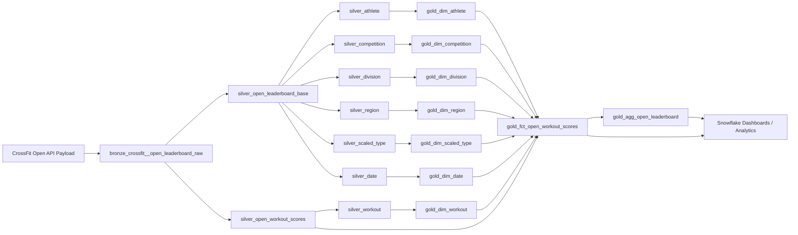

# CrossFit Open Analytics — dbt + Snowflake

## Overview

This project demonstrates a modern analytics engineering pipeline built using **Snowflake and dbt** to transform CrossFit Open leaderboard data into an analytics-ready model.

Raw CrossFit Open API payloads are ingested into Snowflake and transformed through a **Bronze → Silver → Gold medallion architecture** into a dimensional star schema that supports performance analysis, competition insights, and leaderboard reporting.

The project emphasizes **clear data lineage, modular modeling, atomic facts, and derived aggregates**, following modern analytics engineering best practices.

---

## Project Objective

Transform raw CrossFit Open leaderboard data into a model that answers:

- Who wins each division?
- How consistent are top athletes?
- Which workouts create the most separation?
- How competitive are divisions?

---

## Modeling Approach

### Atomic Facts vs Derived Aggregates

- Atomic facts = lowest grain (event-level)
- Aggregates = derived from facts
- Dimensions = reusable context

### Implementation

- `gold_fct_open_workout_scores` → atomic fact  
- `gold_agg_open_leaderboard` → derived aggregate  

---

## Architecture Overview




---

## Bronze Layer

- `bronze_crossfit__open_leaderboard_raw`

---

## Silver Layer

### Base
- `silver_open_leaderboard_base`

### Entities
- `silver_athlete`
- `silver_competition`
- `silver_date`
- `silver_division`
- `silver_region`
- `silver_scaled_type`
- `silver_workout`

### Transactional
- `silver_open_workout_scores`

---

## Gold Layer

### Dimensions
- athlete, competition, division, region, scaled type, workout, date

### Fact
- `gold_fct_open_workout_scores`

### Aggregate
- `gold_agg_open_leaderboard`

---

## Grain Summary

| Model | Grain |
|------|------|
| silver_open_leaderboard_base | athlete + competition |
| silver_open_workout_scores | athlete + workout |
| gold_fct_open_workout_scores | athlete + workout |
| gold_agg_open_leaderboard | athlete + competition |

---

## Key Business Mappings

### Division

| Code | Division |
|------|----------|
| 1 | Men |
| 2 | Women |
| 18 | Men 35–39 |

### Scaled Type

| Code | Meaning |
|------|--------|
| 0 | Rx |
| 1 | Scaled |

### Region

| Code | Meaning |
|------|--------|
| 0 | Worldwide |

---

## Data Quality

The project includes dbt tests to ensure data integrity.

Tests validate:
- surrogate key uniqueness  
- not-null constraints on foreign keys  
- referential integrity between facts and dimensions  
- aggregate grain correctness  

---

## Example Transformation Flow

```
API Payload
  ↓
Bronze Raw
  ↓
Silver Base + Entities
  ↓
Silver Workout Scores
  ↓
Gold Dimensions
  ↓
Gold Fact
  ↓
Gold Aggregate
```

---

## Analytical Dashboard

The Snowflake dashboard surfaces insights from the dimensional model.

---

### 1. Athlete Consistency

**Visualization:** Distribution of Top-10 Finishes

- Most athletes achieve a single Top-10 finish  
- Elite athletes consistently appear across multiple workouts  

---

### 2. Workout Difficulty

**Visualization:** Rank Spread by Workout

- Larger spreads indicate higher difficulty  
- Difficulty varies across divisions and years  

---

### 3. Competition Winners

**Visualization:** Division Winners Table

Example:
- Men — Colten Mertens  
- Men 35–39 — Henry Matthews  
- Women — Mirjam von Rohr  

---

### 4. Division Competitiveness

**Visualization:** Average Rank by Division

- Lower average ranks indicate stronger competition  
- Participation volume influences distribution  

---

## Technologies Used

- Snowflake
- dbt
- SQL
- Medallion Architecture
- Dimensional Modeling

---

## dbt Documentation

This project includes interactive dbt documentation and lineage graphs.

Generate locally:

```bash
dbt docs generate
dbt docs serve
```

---

## How to Run

```bash
dbt deps
dbt run
dbt test
```

Run specific models:

```bash
dbt run --select silver_open_workout_scores
dbt run --select gold_fct_open_workout_scores
dbt run --select gold_agg_open_leaderboard
```

---

## Summary

This project demonstrates how to:

- transform nested API data into a structured analytics model  
- apply dimensional modeling best practices  
- separate atomic facts from derived aggregates  
- build scalable, testable data pipelines using dbt  

The result is a clean, maintainable data model capable of powering real-world analytics use cases.
