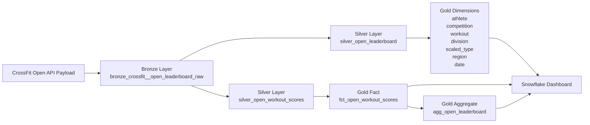

# CrossFit Open Analytics — dbt + Snowflake

## Overview

This project demonstrates a modern analytics engineering pipeline built using **Snowflake and dbt** to transform CrossFit Open leaderboard data into an analytics-ready model.

Raw CrossFit Open API payloads are ingested into Snowflake and transformed through a layered architecture into a **dimensional star schema** that supports performance analysis, competition insights, and leaderboard reporting.

The project emphasizes **clear data lineage, atomic modeling, and derived aggregates**, following modern best practices in analytics engineering.

---

## Project Objective

The objective of this project is to transform **raw CrossFit Open leaderboard API data** into a clean, reliable analytical model capable of answering key performance questions:

- Who wins each division of the CrossFit Open?
- How consistent are top-performing athletes across workouts?
- Which workouts create the greatest separation between competitors?
- How competitive are different divisions?

These questions are answered through a **dimensional model built in dbt and visualized in Snowflake dashboards**.

---

## Modeling Approach

This project follows modern analytics engineering principles by clearly separating:

### Atomic Facts vs Derived Aggregates

- **Atomic facts** capture data at the lowest level of granularity  
- **Aggregates** are derived from atomic facts, not sourced directly  

### Design Principles

- Build facts at the **event level (lowest grain)**
- Derive business-level outputs (like leaderboards) from those facts
- Maintain **traceability back to source data**
- Avoid duplicating business logic across models

### Implementation

- `gold_fct_open_workout_scores` → atomic workout-level fact  
- `gold_agg_open_leaderboard` → derived leaderboard aggregate  

This ensures:
- flexibility for new analyses  
- consistency across metrics  
- a scalable and maintainable model  

---

## Architecture Overview

The pipeline follows a **Medallion Architecture (Bronze → Silver → Gold)**:



---

## Bronze Layer

### Model
- `bronze_crossfit__open_leaderboard_raw`

### Purpose

- Store raw API payloads exactly as received  
- Preserve full data lineage  
- Capture ingestion metadata  
- Enable replayability  

---

## Silver Layer

### Models
- `silver_open_leaderboard`
- `silver_open_workout_scores`

### Purpose

- Flatten nested JSON structures  
- Normalize athlete and workout records  
- Standardize business keys  
- Apply data type transformations  
- Prepare data for dimensional modeling  

---

## Gold Layer

The Gold layer provides a **dimensional star schema** optimized for analytics.

---

### Dimension Tables

- `gold_dim_athlete`
- `gold_dim_competition`
- `gold_dim_workout`
- `gold_dim_division`
- `gold_dim_scaled_type`
- `gold_dim_region`
- `gold_dim_date`

These dimensions provide reusable attributes for analysis across facts.

---

### Fact & Aggregate Tables

#### gold_fct_open_workout_scores

Atomic fact table representing workout-level athlete performance.

**Grain**
- one row per athlete + competition slice + workout

**Use Cases**
- analyze workout performance  
- evaluate athlete consistency  
- compare performance across workouts  

---

#### gold_agg_open_leaderboard

Derived aggregate representing final leaderboard results.

**Grain**
- one row per athlete + competition slice

**Derived From**
- `gold_fct_open_workout_scores`

**Use Cases**
- determine competition winners  
- analyze final rankings  
- compare divisions and performance tiers  

---

## Grain Summary

| Model | Grain |
|------|------|
| silver_open_leaderboard | one row per athlete per competition slice |
| silver_open_workout_scores | one row per athlete + workout |
| gold_dim_athlete | one row per athlete |
| gold_dim_competition | one row per competition slice |
| gold_dim_workout | one row per competition slice + workout |
| gold_fct_open_workout_scores | one row per athlete + competition slice + workout |
| gold_agg_open_leaderboard | one row per athlete + competition slice |

---

## Data Modeling Guarantees

The model enforces:

- one record per athlete per workout in the atomic fact  
- one record per athlete per competition slice in the aggregate  
- no duplicate leaderboard records  
- complete dimensional key coverage  

These guarantees ensure consistency between workout-level and leaderboard-level analysis.

---

## Key Business Mappings

### Division

| Code | Division |
|----|----|
| 1 | Men |
| 2 | Women |
| 18 | Men 35–39 |

---

### Scaled Type

| Code | Meaning |
|----|----|
| 0 | Rx |
| 1 | Scaled |

---

### Region

| Code | Meaning |
|----|----|
| 0 | Worldwide |

---

## Data Quality

The project includes dbt tests to ensure data integrity.

Tests validate:
- surrogate key uniqueness  
- not-null constraints on foreign keys  
- referential integrity between facts and dimensions  
- aggregate grain correctness  

---

## Example Transformation Flow

```
Raw API Payload
      ↓
bronze_crossfit__open_leaderboard_raw
      ↓
silver_open_leaderboard
silver_open_workout_scores
      ↓
gold_dim_* tables
      ↓
gold_fct_open_workout_scores
      ↓
gold_agg_open_leaderboard
      ↓
Snowflake Dashboard
```

---

## Analytical Dashboard

The Snowflake dashboard surfaces insights from the dimensional model.

---

### 1. Athlete Consistency

**Visualization:** Distribution of Top-10 Finishes

- Most athletes achieve a single Top-10 finish  
- Elite athletes consistently appear across multiple workouts  

---

### 2. Workout Difficulty

**Visualization:** Rank Spread by Workout

- Larger spreads indicate higher difficulty  
- Difficulty varies across divisions and years  

---

### 3. Competition Winners

**Visualization:** Division Winners Table

Example:
- Men — Colten Mertens  
- Men 35–39 — Henry Matthews  
- Women — Mirjam von Rohr  

---

### 4. Division Competitiveness

**Visualization:** Average Rank by Division

- Lower average ranks indicate stronger competition  
- Participation volume influences distribution  

---

## Technologies Used

- Snowflake  
- dbt  
- SQL  
- Medallion Architecture  
- Dimensional Modeling  
- Star Schema Design  

---

## dbt Documentation

This project includes interactive dbt documentation and lineage graphs.

Generate locally:

```bash
dbt docs generate
dbt docs serve
```

---

## How to Run the Project

```bash
dbt deps
dbt run
dbt test
```

To run specific models:

```bash
dbt run --select gold_fct_open_workout_scores
dbt run --select gold_agg_open_leaderboard
```

---

## Summary

This project demonstrates how to:

- transform nested API data into a structured analytics model  
- apply dimensional modeling best practices  
- separate atomic facts from derived aggregates  
- build scalable, testable data pipelines using dbt  

The result is a clean, maintainable data model capable of powering real-world analytics use cases.
